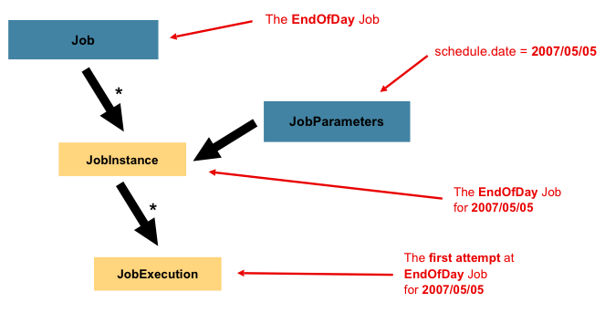
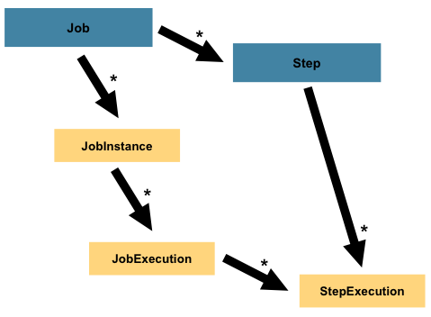

[문서](http://localhost:8080/docs)

# 완성된 것

## AreaCode
```sh
curl -X POST 'http://localhost:8080/areaCode' -H 'accept: application/json' -d ''
```

```sh
Invoke-WebRequest -Uri 'http://localhost:8080/areaCode' -Method 'POST' -Headers @{ 'accept' = 'application/json' } -Body ''
```

## Sigungu_codes

# 준비물
1. 데이터베이스  
  mysql 이 필요합니다. 32769 port  
  MYSQL_ROOT_PASSWORD = zxcvb2  
  MYSQL_DATABASE = ssafy_trip_batch

2. 테이블 생성 
   - resources/schema-mysql.sql 을 실행시켜줍니다.
   - resources/create-mysql 을 실행시켜줍니다.

# 시작 방법
시작 방법은 커맨드 전용과 API 전용이 있습니다.
- 커맨드 전용
  - 커맨드 전용은 jar 파일 실행시 전달되는 프로그램 인수 를 해석하여서 해당되는 서비스만 실행한 후 종료됩니다.
  - 프로그램 인수로 command 를 넣어주고 또 다른 인수는 key=value 형식으로 전달해 주면됩니다.
- API 전용
  - 아무런 프로그램 인수 없이 어플리케이션을 실행합니다.
  - 8080 포트로 webflux 가 실행됩니다.
  - API [문서](http://localhost:8080/docs) 를 참고하면 됩니다.

# 개념 설명

## Job


Job:  
전체적인 배치 처리를 담당하는 객체입니다. 단순히 Step 의 콘테이너 역활을 합니다.  
보통 flow 안에 논리적으로 여러 Step 들이 합쳐져 있습니다. 모든 스텝에 대해 global 한 속성을 구성할 수 도 있습니다.


JobInstance:  
논리적인 job 의 실행 을 의미합니다. 예를 들어 특정 날짜마다 실행되는 잡 이 있을 수 있습니다.


JobParameters:  
배치 잡을 실행하는데 사용될 파라미터들을 가지고 있습니다.

### JobInstance = Job + identifying JobParameters


JobExecution:  
Job 을 실행하려고 하는 하나의 시도 라고 볼 수 있습니다.  
이 실행은 성공일 수 도 있고 실패일 수도 있습니다.

## 정리 
- Job 은 job 이 뭔지를 정의하고 어떻게 실행 될지를 정의합니다.
- JobInstance 는 실행을 그룹화하기 위한 객체로, 올바른 재시작을 위해 사용됩니다.
- JobExecution 은 실행 동안에 실제로 어떤 일이 발생했는지 에 대한 주요 저장 메커니즘이며, 저장되어야 할 중요한 속성들을 가지고 있습니다.

같은 JobInstance 는 동시에 실행되지 못합니다. JobExecutionAlreadyRunningException

BATCH_JOB_INSTANCE,  
BATCH_JOB_EXECUTION,  
BATCH_JOB_EXECUTION_PARAMS  


## Step



Step:  
독립적이고 순차적인 잡의 단계를 의미합니다.  
그래서 모든 Job 은 하나 이상의 step 들로 구성됩니다.  
Step 은 실제 배치 처리과정에서 필요한 모든 정보를 정의하고 제어하는 정보를 포함하고 있습니다.  
Step 은 개발자가 원하는 의도한 만큼 작아지거나 커질 수 있습니다.  


StepExecution:  
Step 의 실행 한 번 을 의미합니다.  
Step 이 시작 될 때마다 세로운 StepExecution 이 만들어집니다.  
각각의 execution 은 연관되느 step 과 jobExecution 을 포함하고 있습니다.  
트랜잭션 관련된 정보도 가지고 있습니다. commit 횟수, roll-back 횟수, 시작, 끝 시간.  


## ExecutionConText
StepExecution 객체 또는 JobExecution 객체 마다 가질 수 있는 key/value 쌍의 집합입니다.  
필요한 정보를 저장할 수 있습니다. 보통 재시작을 위한 정보를 보관할 때 씁니다.  
예를 들어 특정 파일을 읽는 ItemReader 가 있다고 했을 때, 커밋 시마다 저장하는 ExecutionContext 정보를 통해서  
갑작스러운 오류가 발생하더라도 ExecutionContext 를 통해 다시 시작 할 수 있습니다.


## 청크 기반 Step

청크 : 청크는 트랜잭션이 커밋 되기 전에 처리되는 아이템의 수를 의미합니다.  
